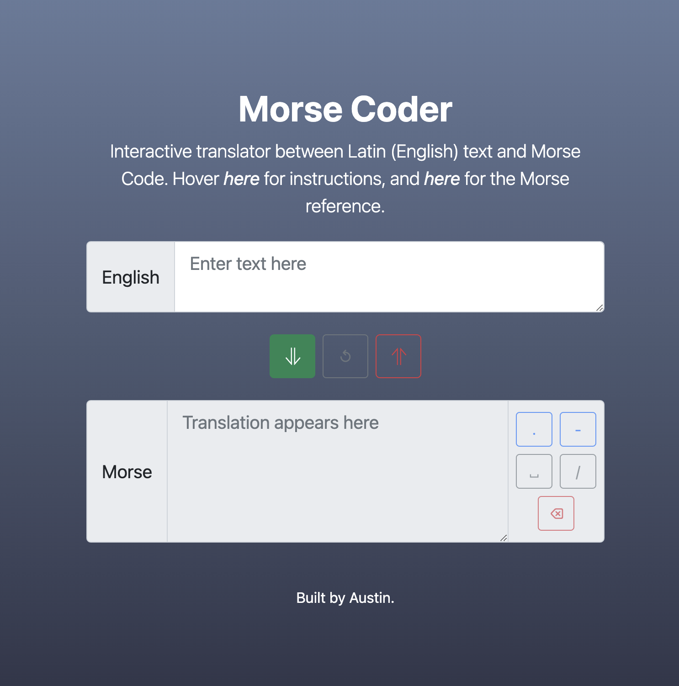

# Morse-Coder

## Description

A project that uses objects, complex data, and DOM manipulation in JavaScript and HTML to allow interactive translation of English text into Morse Code as well as the reverse.

## Launch

The live project can be launched [here](https://austnly.github.io/morse-coder/).

<figure>

<figcaption><i>Live Project Screenshot</i></figcaption>
</figure>

## Goals

-   To manipulate object data types in JavaScript
-   To practice manipulating the DOM using JavaScript
-   To create a functional, intuitive translator interface using the **Bootstrap** framework

### MVP

1. Create a user interface that allows the user to either input some English text or some Morse Code
1. Create JS functions that would allow the user to translate their English text into Morse Code or Morse Code into English text
1. Make sure to handle spaces properly (ie. there is 1 space between English words, but one space between Morse Code characters)

## Implementation

### Logic Plan

Prior to coding the JavaScript, I formed a plan for the logic of the translator to help structure my subsequent working code.

1. A textarea field should allow keyboard input in latin/English characters
1. As characters are entered, this should update an output field in Morse code
1. We must iterate through each character of the string, find the character in a reference Object containing key-value pairs that pair the exact character with its corresponding Morse code
1. A new collection (or array) of corresponding characters in Morse should be created and then joined into a single string
1. The output field should update with this string
1. The reverse should also be allowed, but preferably only if the mode is selected by the user by clicking a button

### Code

1. I started with a Morse Code [reference object](https://gist.github.com/mohayonao/094c71af14fe4791c5dd) available on github gists.
1. I structured the HTML and SCSS using a [template](https://getbootstrap.com/docs/5.1/examples/heroes/) and [input](https://getbootstrap.com/docs/5.1/forms/input-group/) and [button](https://getbootstrap.com/docs/5.1/components/buttons/) components from the Bootstrap docs.
1. I added Event Listeners to each textarea field to update the corresponding output field on any input, so characters are translated immediately
1. I coded the logic for the translation itself, using split, map, Object.entries, and join functions to create an array of characters, then create a new array with the corresponding Morse character (or reverse) by finding the matching pair in a reference object, and then joining the final array in the correct format.
1. I disabled user input for the output area corresponding to the translation direction silected.
1. I added a clear button, input buttons for Morse Code and Tooltip hover features from Bootstrap for added usability.
1. I modularised the code, separating into generic one-way translation functions (translate.js), and page-specific code (script.js).

### Issues Addressed

I encountered the following issues during implementation and implemented a fix for each case.

- [x] Handle conventional word spacing => Replaced word spaces with " / " for readability in Morse
- [x] Awkward keyboard input on mobile => Added input buttons for Morse, as well as spaces and backspaces
- [x] Inconsistent whitespaces in Morse input => Used Regular Expressions to ensure single spaces refer to Morse character spaces, any consecutive whitespaces or "/" with adjacent spaces would translate to word spaces in the English output
- [x] Event Listeners for textarea "change" and "input" would not trigger translation to update when using the Morse Input buttons => Called the translation functions to update on any input button click
- [x] Poor appearance on smaller screens due to width of left input-group labels => Media queries added to change visibility of labels with display: none, and border-radius added to left corners of textarea inputs to match original styling

## Future Additions

- [ ] Neater hidden Morse Reference
- [ ] Playable Morse sounds would be fun
